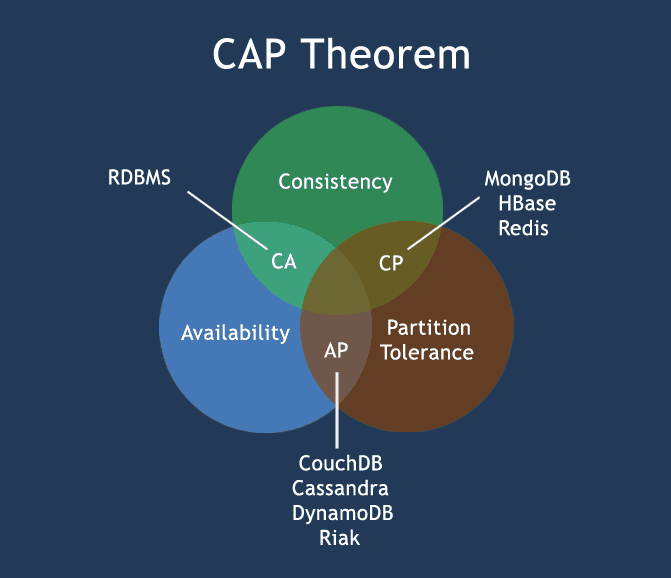
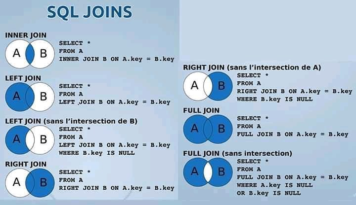

# MARKDOWNS

General notes on systems.

Table of contents
=================

1. [ACID properties](#ACID-properties)
2. [Distributed Systems](#distributed-systems)
3. [Functional-vs-Non-Functional requirements](#Functional-vs-Non-Functional-Requirements)
4. [CAP Theorem](#CAP-theorem-(Brewer's-Theorem))
5. [SQL and DB general practice](#SQL-PRACTICE)

# ACID properties

These are the rules followed by classical relation databases. They require that a database transaction be:

## 1. Atomic

_All or nothing rule_. A transaction should be a logical unit of work which must be completed with all its data modifications, or none at all. In short, a transaction should take place at once, or not at all.

**Example:**_Transferring money from one account to another. Such a transaction should not stop in the middle of the process without delivering the funds to the designated account, and if it does, it should fail in all._

## 2. Consistent

At the end of the transaction, all data must be in a consistent state. All data in the database should be consistent before and after a transaction.

**Example:** _Depositing funds to a bank account> After depositing the funds, one should be able to see that the account balance has increased in direct proportion to the deposited funds._

## 3. Isolated

Modifications on data by particular transaction ought to be independent from those done by other transactions. Multiple transactions should occur independently without interference.

**Example:** _Joint bank account. When you and your husband buy something, those transactions should be different and should result in a change in account balance that reflects each transaction independently, e.g. if one buys a car, and the funds are inadequate for another transaction then it should be reflected and isolated, this way 2 charges don't happen at the same time. First transaction should complete, then second transaction can take place_.

## 4. Durable

After the completion of a transaction, the resulting changes should persist and be permanent. Regardless of issues such as system failure.

**Example:** _If you completed a transaction in which you deposited funds into your bank account via the ATM, but for some reason the ATM fails without confirming or printing the receipt, the transaction should still be reflected on your bank account information. This aspect is because each transaction's modifications and updates are stored in disk or permanent storage._

# Distributed Systems

These are connected systems that are composed of computers, computer components and software, which interact with each other and share the system's' resources. They are connected using a Local Area Network or Wide Area Network. Could be composed of any number of possible configurations, for example:

* Workstations
* Personal computers
* Mainframes, etc.

## Advantages of Distributed Computing

1. **Reliability** *(*fault tolerance*)*: The system remains operating despite some machines failing.
2. **Scalability**: Easy scalable, by adding more machines as needed.
3. **Resource sharing**: The system facilitates sharing of its resouces between and with connected applications.
4. **Flexibility**: System is very easy to debug, implement new services and make new installations.
5. **Speed**: The increased computation potential afforded by all connected components increases the  speed of transactions accordingly.
6. **Open system**: As it is open system, every service is equally accessible to every client, i.e. local or remote.
7. **Performance**: Collection of processors in the system can provid higher performance (and better price/performance ratio) than a centralized computer.

## Disadvantages of Distributed Computing

1. **Troubleshooting**: Diagnosing the source of problems could be hard.
2. **Software**: Less software support.
3. **Networking**: Several issues could arise due to network issues, including:
   * Transmission issues
   * Loss of data
   * Overloading
4. **Security**: Ease of accessing other parts of system or data is increased by the number of connected components, hence decreasing security.

## Scalability

This is the ability of a system to expand and meet the needs of the business. For instance, scaling Facebook would entail ensuring that all the people using it as well as those who want to use it can be accommodated, even if it surpasses billions of people.

**a. Vertical scaling (_Scale Up_):** Adding resources within the same logical unit to increase capacity. For example, increasing the number of CPUs to an existing server, or increasing the memory in the system's servers or expanding storage by adding hard drive.

**b. Horizontal scaling (_Scale Out_):** This means adding more nodes to the system, such as adding a new computer to a distributed software application. In NoSQL system, data store can be much faster as it takes advantages of **_scaling out_** which would entail adding more nodes to a system and distribute the load over those nodes.

## Sources

1. [w2resource](https://www.w3resource.com/mongodb/nosql.php)

# Functional vs Non-functional requirements

## 1. Functional requirements

This is what describes a system and its parts. Describes the functions a system must perform. Functions have to do with inputs, outputs and behavior. This can be calculations, data manipulations, business processes, user interactions and other characteristics attributable to what the system can perform. The functional system requirements "help capture the intended behavior of the system."

## 2. Non-functional requirements

Include the quality attributes of a system. They are normally a set of standards that can be used to judge the specific operation of a system. They are essential to ensuring the usability and effectiveness of a software system. Failing to meet these requirements can result in systems that fail to meet user needs.

Non-functional requirements allows you to impose constraints or restrictions on the design of the system across the various agile backlogs. For example, site should load in 2 seconds when the number of simultaneous users exceed 1000000.

## Key differences

1. **FR** **(functional requirements)** define a system or its components, while **NFR (non-functional requirements)** define the performance attribute of a software system.
2. **FR** with requirement analysis help id missing requirements, while **NFR** ensures good user experience and ease of using the software.
3. **FR** is a **_verb_**, while **NFR** is an **_attribute_**.
4. Types of **NFR**:
   * Scalability capacity
   * Availability
   * Reliability
   * Recoverability
   * Data integrity
5. Types of **FR**:
   * Transaction corrections
   * Transactions adjustments
   * Cancellations
   * Administrative functions
   * External interfaces
   * Authorization levels
   * Historical data management

## Examples of FR

1. Background color for all windows in the application will be green.
2. Only managerial level employees will be able to review revenue data.
3. Software system should be integrated with the banking API.
4. Software should automativcally validate customers.

## Examples of NFR

1. Users should immediately change the first assigned password after first successful login.
2. Employees should never be allowed to update their salary requirement.
3. Unsuccessful attempts by users to access an item of data should be recorded on audit trail.
4. Website should be able to support 1000000 users at any one time without affecting its performance.
5. Software should be transferrable to other operating systems without any issues.
6. Export of confidential and intellectual property should be reviewed and audited.


| **Parameters** | **Functional Requirement** | **Non-Functional Requirement** |
| - | - | - |
| What is it? | Verb<br/><br/> | Attributes<br/><br/> |
| Required | Yes<br/><br/> | No |
| Captured in | Use case | By quality |
| End-result | Product feature<br/><br/> | Product quality |
| Substantiation | Easy to subtantiate<br/><br/> | Hard to subtantiate<br/><br/> |
| Objective | 'GPS' for software functionality | 'GPS' for software performance |
| Focus | User requirement | User's expectation. |
| Documentation | Describes what the product does | Describes how the product works |
| Testing | Functional Testing like System, Integration, End to End, API testing, etc. | Non-Functional Testing like Performance, Stress, Usability, Security testing, etc. |
| Test Execution | Test Execution is done before non-functional testing. | After the functional testing |
| Product Info | Product Features<br/><br/> | Product Properties |

## Terms

1. **User requirements**: These can be represented visually or using statements(some of which might be abstract, and very general), e.g. Google drive will provide storage for all its users.
2. **System requirements**: Very detailed descriptions of software system's "functions, services, and operational constraints" (Sommerville, p. 83). The documentation of such requirements can be called the **functional specification**, and it is supposed to document exactly what ought to be implemented.

## Sources

1. [Guru99](https://ww.guru99.com/functional-vs-non-functional-requirements.html )

# CAP Theorem (Brewer's Theorem)

An important theorem in designing distributed systems. Echoes that there is no simultaneous guarantee of **CAP (consistency, availability, and partition tolerance)**; in essence, something has to give.



The 3 basic requirements when designing applications for a distributed architecture:

* **Consistency**: data remains consistent after the execution of an operation, across all nodes. After an update, all clients/nodes see the same data at the same time. Standard database replication is normally not consistent due to replication lag. On the other hand, _perfect instantaneous global consistency_ is impossible.
* **Availability**: a guarantee that the system is always ON, without downtime; reading and writing can always take place.
* **Partition-tolerance**: system continues to operate despite arbitrary message loss or failure of part of the system. For example, if communication between the servers is unreliable, the system should still continue to function, due to the other functioning and unconnected partitions.

Theoretically, it is impossible to fulfill all 3 requirements. In a distributed context, **CAP** formulates the basic requirement of 2, either CP or AP.

From _[Thoughts from the red planet](https://http://nathanmarz.com/blog/how-to-beat-the-cap-theorem.html)_. **CP**: Data might not be available, but it is accurate and consistent across all the nodes. If **consistency** is chosen, then what happens to availability? Do you buffer writes for later? If the machiens with the buffers fails, won't all the writes be lost? Also, isn't buffering writes somewhat against the grain of _being consistent_, since the data isn't updated in the database yet. Another option would be to return an error to the client, which would probably work against the company's reputation.

**AP** : System always available and partitioned, but some of the data might not be same as viewed from different nodes. The other option would be going for **availability**. The best guarantee of consistency in these systems is **_eventual consistency_**. This would mean reading a different result than the expected result. In such cases, multiple readers to the same system will see different content at the same time. For instance, Youtube views/subscriptions for some videos could be eventually consistent, with someone from one location seeing say 1000000 subscribers/views and another person seeing 1000010. This is due to the updates not having propagated to all  the replicas instantaneously. Such differences when noted could tracked by developers using "vector clocks and merging the updates together (**read repair**)".

CA _only_, is implausible(since it implies the system will never fail, drop messages, etc.). Additionally, it fails to meet the requirements in a distributed(i.e., multi-node) systems context, since probability of something going wrong increases with increase in partitions (even single site clusters). The downside of a single node/monolithic system is perhaps much worse(eggs in one baske scenario), despite the lower probability, if the system is really prime. An example is from _sources 2_, where one node has a 99.9% chance of failure, but a cluster of 40 such nodes increases the failure chance to about 96.1%.

From _[Thoughts from the red planet](https://http://nathanmarz.com/blog/how-to-beat-the-cap-theorem.html)_ , a workaround to beating the **CAP theorem** is working with immutable data, such that, queries and functions on data in the distributed systems, nolonger have to _Update_ or _Delete_ data.."no divergent values, vector clocks, or read-repair(s)." The data either **exists** or **doesn't**;"just data and functions on the data." The complexities were arising from the incremental updates/writes on mutable data, and the interaction of such functional requirements and the CAP properties. So, by "rejecting  incremental updates, embracing immutable data, and computing queries from scratch each time, you avoid that complexity." This statement is more of a testament of a solution existing, rather than an actual solution since the it is not plausible to compute queries each time.

A **BASE** [system](https://www.w3resource.com/mongodb/nosql.php) gives up on consistency. Essentially:

1. **B**asically **A**vailable indicates that the system does **_guarantee availability_**, in terms of the CAP theorem.
2. **S**oft state indicates that the state of the system may change over time, even without input. This is because of the eventual consistency model.
3. **E**ventual consistency indicates that the system will become consistent over time, given that the system doesn't receive input during that time.

## ACID vs BASE


| ACID | BASE |
| - | - |
| **Atomic** | **B**asically **A**vailable |
| **C**onsistency | **S**oft state |
| **I**solation | **E**ventual consistency |
| **D**urable |   |

To ensure consistency, some popular protocols to consider include:

1. **Two-Phase Commit ([2PC](https://www.cs.princeton.edu/courses/archive/fall16/cos418/docs/L6-2pc.pdf)):** "General purpose, distributed agreement on some action, with failures. Different entities playing different roles in action. Example: Transfering money between two banks, require that both bank acknowledge transaction, or neither. And require that no 1 bank to act alone (_all or nothing atomic commit protocol_)."
2. Eventual consistency (vector clock + RWN) [read](https://titanwolf.org/Network/Articles/Article?AID=d4ec31f9-db30-4cb2-9889-bcf6089f370a#gsc.tab=0).
3. Paxos [read](https://www.cs.yale.edu/homes/aspnes/pinewiki/Paxos.html).
4. In-Sync [Replica](http://www.confluent.io/blog/hands-free-kafka-replication-a-lesson-in-operational-simplicity/), etc.

To ensure availability, we can add replicas for the data. As to components of the whole system, people usually do _cold standby, warm standby, hot standby, and active-active_ to handle the failover.

## SOURCES

1. [Thoughts from the red planet](http://nathanmarz.com/blog/how-to-beat-the-cap-theorem.html)
2. [You can't sacrifice partition tolerance](https://codahale.com/you-cant-sacrifice-partition-tolerance/)
3. [Dr. Eric A. Brewer's Slides](https://people.eecs.berkeley.edu/~brewer/cs262b-2004/PODC-keynote.pdf)
4. [Research paper](https://citeseerx.ist.psu.edu/viewdoc/download?doi=10.1.1.67.6951&rep=rep1&type=pdf)
5. [w3resource](https://www.w3resource.com/mongodb/nosql.php)
6. [Princeton notes](https://www.cs.princeton.edu/courses/archive/fall16/cos418/docs/L6-2pc.pdf)
7. [Yale notes](https://www.cs.yale.edu/homes/aspnes/pinewiki/Paxos.html)
8. [Confluent](https://www.confluent.io/blog/hands-free-kafka-replication-a-lesson-in-operational-simplicity/)


# SQL-PRACTICE

## Sample Interview Questions and Answers

###### 1. Difference between SQL and MySQL?

* **SQL** stands for Structured Query Language, and is the standard language of relational databases, and is used for accessing and managing databases.
* **MySQL** is an example of a relational database management system.

###### 2. What are the different subsets of SQL?

* **DDL (Data Definition Language)**: Allows you to perform operations such as CREATE, ALTER and DELETE.
* **DML (Data Manipulation Language)**:  Allows access and manipulation of the database. Allows insertions, updates, deletes and retrieval of the data.
* **DCL (Data Control Language)**: Allows you to control access to the database. Example, Grant, Revoke access permissions.

###### 3. What do you mean by DBMS?

* A database is a structured collection of data.
* A **Database Management System (DBMS)** is a software application that interacts with the user, applications and the database itself to capture and analyze the data.

###### 4. What are the different types of DBMS?

* Relational Database Manage System, where data is stored in relations (tables).
* Non-Relational Database Management System, where there is no concept of relations, tuples and attributes.

###### 5. What do you mean by table, field and record in SQL?

* A **table** is a collection of data in the form of rows and columns.
* *Rows* are known as **records** and are individual entries in tables, and give complete information about a particular entry or entity as far as the table is concerned.
* *Columns* are known as **fields**; and have has specific information about the data (could be age, id, etc.).

###### 6. What are joins in SQL?

* These are clauses used to combine rows from two or more tables, based on a related column between them. You can merge and read or retrieve data from there.

###### 7. List the different type of joins?



* Inner Join
* Right Join
* Left Join
* Full

###### 8. What is the difference between Cross and Natural Join?

* **NATURAL** join is based on all the columns having the same name and data types in both tables.
* **_Student_table_**


| Id | Name | Address |
| - | - | - |
| 1 | Tom | Disney Pl |
| 2 | Jerry | Disney St |

* **_Scores_table_**


| Id | Assignment_score | Exam_score |
| - | - | - |
| 2 | 90 | 95 |
| 3 | 100 | 100 |

* Query to run:

```sql
SELECT *
FROM Student_table NATURAL JOIN Scores_table;
```

* **_Results:_**


| Id | Name | Address | Assignment_score | Exam_score |
| - | - | - | - | - |
| 2 | Jerry | Disney St | 90 | 95 |

* **CROSS** join produces the **CROSS PRODUCT** or **CARTESIAN PRODUCT** of two tables. It creates all possible pairings of rows from two tables, whether they match or not. Each row is extended as many times as there are rows in the crossed table, by each row in that crossed table. This will result in duplicated data(or similar columns) in the final result.
* **Example**:

```sql
SELECT * 
FROM Student_table CROSS JOIN Scores_table;
```

* **Results**:


| Id | Name | Address | Id | Assignment_score | Exam_score |
| - | - | - | - | - | - |
| 1 | Tom | Disney Pl | 2 | 90 | 95 |
| 1 | Tom | Disney Pl | 3 | 100 | 100 |
| 2 | Jerry | Disney St | 2 | 90 | 95 |
| 2 | Jerry | Disney St | 3 | 100 | 100 |

* [More Sources](https://www.geeksforgeeks.org/difference-between-natural-join-and-cross-join-in-sql/)

###### 9. What is the difference between CHAR and VARCHAR datatype in SQL?

* **CHAR** is used for characters datatype, and strings of fixed lengths, .e.g. CHAR(10) can ONLY store 10 characters, not more or less.
* **VARCHAR** is used for character strings of variable length,.e.g. VARCHAR(10), will hold any length strings upto 10. If a string is longer than the stipulated length, in this case 10, then the string ends up getting truncated.

###### 10. What is a Primary key?

* A Primary Key is a column/collection of columns/set of columns/ that uniquely identifies each row in a table.
* Uniquely identifies each row in the table.
* NULL values not permitted.

###### 11. What is a Unique Key?

* This is a key that Uniquely identifies a single row in a table.
* Multiple values are allowed per table.
* NULL values are allowed.

###### 12. What is a Foreign Key?

* Foreign key **maintains referential integrity** by enforcing a link between the data in the two tables.
* Foreign Key in the child referrences the Primary Key in the parent table.
* Foreign Key constraint prevents actions that would destroy links between the child and parent tables.

###### 13. What are constraints?

* These are statements that are used to specify the limits on the data to include in a table's columns'.
* Constraints can be specified:
  * At the column level, specified as part of column definition, and applied to that column only.
  * Independently, at the table level. In this case, the constraint rules will be applied to more than one column in the specified table. Constraint can be specified in the:

    * **_CREATE TABLE T-SQL command_**
    * **_ALTER TABLE T-SQL command_**
  * For instances, some terms that constrain a table and what to include are:

    * **NOT NULL:** Prevents inserting Null values in the column, requiring that this column always contains valid NOT NULL SQL data.

      ```sql
      USE this_db
      GO
      CREATE TABLE ConstraintExample(
           ID INT NOT NULL,
           Name VARCHAR(50) NULL -- if name not provided, default is NULL
      )
      INSERT INTO ConstraintExample ([ID], [NAME]) VALUES (1, 'JLA') -- successful
      GO
      INSERT INTO ConstraintExample ([ID]) VALUES (2) -- successful
      GO
      INSERT INTO ConstraintExample ([NAME]) VALUES ('JLA') -- unsuccessful (ID CANNOT BE NULL)
      GO
      -- If we want to change Name from accepting  NULL, we use the syntax below:
      ALTER TABLE ConstraintExample ALTER COLUMN [Name] VARCHAR(50) NOT NULL
      /*
      But this will fail too! There is a Name that is NULL, inserted from ID 2 insert above.
      To change it, we have to find all NULLs and replace with an empty string, like..
      */
      UPDATE ConstraintsExample SET [Name]='' WHERE [Name] IS NULL -- this should be successful
      ```
    * **UNIQUE**: Used to ensure that no duplicate values will be inserted into a specific column or combination of columns that are participating in the UNIQUE constraint and not part of the PRIMARY KEY.

      ```sql
      USE this_db
      GO
      CREATE TABLE ConstraintExample(
      ID INT UNIQUE,
      Name VARCHAR(50) NULL -- if name not provided, default is NULL
      )
      INSERT INTO ConstraintExample ([ID], [NAME]) VALUES (1, 'JLA') -- successful
      GO
      INSERT INTO ConstraintExample ([ID], [NAME]) VALUES ('WLD') -- successful, only NULL in col
      GO
      INSERT INTO ConstraintExample ([ID]) VALUES (2, 'GSM') -- successful
      GO
      INSERT INTO ConstraintExample ([NAME]) VALUES (2, 'DHA') -- unsuccessful (ID 2 not UNIQUE)
      GO
      -- A workaround is to either drop the previous one or change new ID to be inserted. 
      ```
    * **PRIMARY KEY**: This is a combination of both NOT NULL and UNIQUE constraint. It can consist of one or more columns, with values that uniquely identify each row in the table. Facilitates data access, and enforces entity integrity of the table. Entity integrity ensures that each row in the table is a uniquely identifiable entity.  The distinction is that the PRIMARY KEY cannot be NULL, unlike UNIQUE (where a column can have a single NULL value). Also, you can only define one SQL PRIMARY KEY(3NF) per table (from the list of candidate keys, if any); and multiple UNIQUE constraints in the same table.
    * **FOREIGN KEY**: A database key that is used to link 2 tables together. FK identifies the relationship between the Child table(the table the FK is found), and the Parent table(Primary Key where the FK exists). It references a column(s) in child table that contains foreign key; the key is a foreigner in the current child table so to speak (but a Primary Key in the parent table). The relationship between the child and parent table is maintained by checking the existence of the child table's FK in the referenced Parent's PK, before any data insertions take place. This ensures referential integrity, similar to that with PK constraint above; together, the referential integrity from the PK and FK form the **key integrity**. Differences between FK and PK are:


      | Primary Key | Foreign Key |
      | - | - |
      | 1 per table | Can be > 1; referencing many parent ta |
      | NO NULLS | If constraint NOT NULL missing in FK, it can be NULL |

      *ACTIONS supported when deleting or updating the parent table's values include:*


      1. "NO ACTION: When ON UPDATE or ON DELETE clauses are set to NO ACTION, the performed update or delete operation in the parent table will fail with an error.
      2. CASCADE: Setting the ON UPDATE or ON DELETE clauses to CASCADE, the same action is performed on the referenced values of the parent table will be reflected to the related values in the child table. If it's DELETE, rows with that FK, are also deleted in child tables.
      3. SET NULL: With this ON UPDATE and ON DELETE clauses option, if the referenced values in the parent table are deleted or modified, all related values in the child table are set to NULL value.
      4. SET DEFAULT: Using the SET DEFAULT option of the ON UPDATE and ON DELETE clauses specifies that, if the referenced values in the Parent table are updated or deleted, the values in the child table with FOREIGN KEY columns will be set to its default value."
    * "**CHECK**: This is a constraint defined on a column or set of columns to limit the range of values, that can be inserted into these columns, using a predefined condition. The CHECK constraint comes into action to evaluate the inserted or modified values, where the value that satisfies the condition will be inserted into the table, otherwise, the inset operation will be discarded. It is allowed to speciy multiple CHECK constraints for the same column.

      Defining the CHECK constraint condition is similar to writing the WHERE clause query, and using the comparison operators (AND, OR, BETWEEN, IN, LIKE and IS NULL) to write the boolean expression; which returns TRUE, FALSE or UNKNOWN. The CHECK constraint will return UNKNOWN value when a NULL value is present in the condition. It will not prevent insertion unless the NOT NULL constraint is enforced. It helps limit the value to store to those defined, or within the specified range or format specified"

      **_Example in code_**:

      ```sql
      CREATE TABLE check_constraint
      (
           ID INT PRIMARY KEY,
           NAME VARCHAR(50) NULL,
           SALARY INT CHECK (SALARY > 0) -- constrained from inserting vals not +
      )
      GO
      INSERT INTO check_constraint ([ID], [NAME], SALARY) VALUES (1, 'GHA', 120)
      GO -- successful
      INSERT INTO check_constraint ([ID], [NAME], SALARY) VALUES (2, 'AKD', NULL)
      GO -- successful
      INSERT INTO check_constraint ([ID], [NAME], SALARY) VALUES (3, 'PHA', 0)
      GO -- unsuccessful
      INSERT INTO check_constraint ([ID], [NAME], SALARY) VALUES (4, 'GGJ', -1)
      GO -- unsuccessful
      * ```sql

      ```
    * **DEFAULT**: Used to provide a default value for specified column if no value has been provided. Helps maintain domain integrity. It could be a Null value, a system function value or even a constant.

      **_Example:_**

      ```sql
      CREATE TABLE constraint_default
      (
           ID INT PRIMARY KEY,
           NAME VARCHAR(50) NULL,
           EMPLOYEED_DATE DATETIME NOT NULL DEFAULT GETDATE()
      )
      GO
      INSERT INTO constraint_default([ID], [NAME], EMPLOYEED_DATE) VALUES (1,'Tom', '2019/01/01')
      GO
      INSERT INTO constraint_default([ID], [NAME], EMPLOYEED_DATE) VALUES (2,'Jerry')
      GO
      ```

###### 14. What is the difference between DROP, DELETE and TRUNCATE statements?

* DROP removes a table and it cannot be rolled back from the database.
* TRUNCATE command removes all the rows from the table, and no rollbacks (faster than DELETE); DDL command.
* DELETE deletes a row in a table, and data can be rolled back after using delete. Slower than truncate.

###### 15. What do you mean by data integrity?

* Accuracy and consistency of the data.

###### 16. What is the difference between clustered and non clustered index in SQL?


| Clustured index | Non-clustered index |
| - | - |
| Only 1 per table | A table can have multiple |
| Easy and faster retrieval of data | Relatively slow |
| Alters the way records are stored (sorts by column which is set be clustered index | Creates a separate object within table that points back to the original table rows after searching |

###### 17. Write a SQL query to display the current date?

* GetDate()

###### 18. What is Normalization and what are its advantages?

* The process of data modeling that reduces redundancy and duplication.
* Some of the advantages are:
  1. Ensures consistency and makes it easy to carryout data modification.
  2. Better database organization and reduces wasting space on duplicate data.
  3. Efficient data access.
  4. Quick to find information.
  5. Easier to maintain security.

###### 19. Explain the different types of Normalization?

* Check ```./normalization.md```

###### 20. What do you mean by Denormalization?

* Technique used to access data from a non normalized form. Introduces redundancy into the tables (which is prevented during normalization). This redundancy increases performances, since it can accomodate more complex queries.

###### 21. What are entities and relationships?

* **_ENTITIES:_** Items/objects about which data can be obtained, and stored in a database. Tables stored data which represent one type of entity. For instance, a company database could have tables for its clients/customers and for its employees. The employee table stores attributes(columns) for each employee.
* **_RELATIONSHIPS:_** The links between **entities**, that show that they have something to do with each other. Could be attributes in the same table, or in different tables (e.g. Walmart employee could be in a table of Walmart employees, yet still be in a table of Customers, with different column attributes, or same).

###### 22. What is an index?

* This is a performance tuning method allowing faster retrieval of precords from the table. An index creates an entry for each value and hence it will be faster to retrieve the data.

###### 23. Explain different types of indexes.

* There are 3 types of index namely:
  1. *Unique index:* this index does not allow the field to have duplicate values if the column is unique indexed. If a primary key is defined, a unique index can be applied automatically.
  2. *Clustered index:* this index reorders the physical order of the table and searches based on the basis of key values. Each table can only have one clustered index.
  3. *Non-clustered index:* Does not alter the physical order of the table but maintains a logical order of the data. Each table can only have many non-clustered index.

###### 24. What is ACID Property in a database?

* Check ```./acid_properties.md```

###### 25. What do you mean by "Trigger" in SQL?

* Automatically executing stored procedures in SQL. Defined to execute after or in place of data modifications. For instance, triggers could be set up to execute  a batch of code when an insert, update or any other query is executed against a specific table.

###### 26. What are the different operators avaliable in SQL?

* There are 3 available operators in SQL, namely:
  1. Arithmetic operators.
  2. Logical operators.
  3. Comparison operators.

###### 27. Are NULL values same as that of zero or blank spaces?

* NO.
* A NULL value represents a value that is unknown, unavailable, or even assigned
* A 0 is a number
* Blank space is a character

###### 28. What is a subquery in SQL?

* This is a query whose output becomes subject of another query. A query inside a query. Subquery always executed first, then result sent to main query.
* The subquery can be nested inside SELECT statements,  UPDATE statements, or any other querries.
* Subqueries can also have comparison operators such as >,< or =.

###### 29. What are the different types of a subquery?

1. **Correlated subquery**:
2. **Non-correlated subquery**:

###### 30. List the ways to get the count of records in a table?

* **_Examples:_**

```

SELECT COUNT(*) FROM table1

SELECT rows FROM sysindexes WHERE id = OBJECT_ID(table1) AND indid < 2
```

###### 31. Write a SQL query to find the names of employees that begin with 'A'?

```sql
SELECT *
FROM EMPLOYEES
WHERE name like('A%')
```

###### 32. Write a SQL query to get the third highest salary of an employee from employee_table?

```sql
SELECT TOP 1 SALARY
FROM (
     SELECT *
     FROM Employees
     ORDER BY Salary DESC
) AS Employees
ORDER BY SALARY ASC;

```

###### 33. What is the need for Group Functions in SQL?

* They enable results to be aggregated over a GROUP of rows. 1 result from the group.
* Some GROUP functions: AVG, SUM, COUNT, MAX, VARIANCE, e.t.c

###### 34. What is a Relationship in database tables? Name some types.

* These are the links between entities or tables.
* They could be:
  1. 1 to many relation (department to college courses)
  2. Many to many relation (students to courses)
  3. Many to one relation (students to project)
  4. Self-referencing relationship ([look it up](http://etutorials.org/SQL/Database+design+for+mere+mortals/Part+II+The+Design+Process/Chapter+10.+Table+Relationships/Types+of+Relationships/))

###### 35. How can you insert NULL values in a column while inserting the data?

* Implicitly by omitting column values from insertions.
* Explicitly by specifying NULL keywords in the values clause.

###### 36. What is the main difference between "BETWEEN" and "IN" condition operators?

* **IN** checks for row value from a specific set of values.
  ```SELECT * FROM Students WHERE Age IN (17, 18, 19)```
* **BETWEEN** checks for row values falling within a given range.```SELECT * FROM Students WHERE Age BETWEEN 17 AND 101```

###### 37. Why are SQL functions used?

* For making calculations, inferrences, determining..
* ..practically, for manipulating, updating, modifying/converting the data.

###### 38. What is the need of MERGE statement?

* Allows conditional update or insertion of data into a table.
* Performs update if row exists, or an insert if the does not exist.

###### 39. What do you mean by recursive stored procedure?

* This is a function that calls itself several times, until some condition is satisfied; could be until it calls itself j number of times, or until the YEAR part of a date changes.

###### 40. What is a CLAUSE in SQL?

* A condition that filters rows in the entire set based on a criteria specified; if the criteria is met, the row is included in the final result,.e.g. HAVING and WHERE clauses.

###### 41. What is the difference between "HAVING" and "WHERE" clauses?

* HAVING clause is applied after GROUPING takes place.
* WHERE applies the condition to each row before even the values are applied to the GROUP BY clause.

  ```sql
  SELECT *
  FROM EMPLOYEES
  WHERE manager IS NOT NULL
  GROUP BY manager
  HAVING direct_report >= 5;
  ```
* [Source of example above.](https://www.sqltutorial.org/sql-having/)

###### 42. List the ways in which Dynamic SQL can be executed?

* Using EXEC.
* Writing a query with parameters.
* USING sp_executesql.

###### 43. What are the various levels of constraints?

* *Column level* constraints.
* *Table level* constraints.

###### 44. How can you fetch common records from two tables?

* Even though MySQL does not have INTERSECT key word, a query behaving like so could be one with an INNER JOIN.

###### 45. List some case manipulation functions in SQL?

1. LOWER: Returns the string argument in lower case. ```LOWER(string_arg)```
2. UPPER: Returns the string argument in upper case. ```UPPER(string_arg)```
3. INITCAP: Returns string with first char in upper case and the rest lower case. ```INITCAP(string_arg)```

###### 46. What are the different set operators available in SQL?

* UNION, MINUS, INTERSECT operators.

###### 47. What is an ALIAS command?

* Commands given to prevent ambiguity when we have same named columns or tables, or to shorted names of columns or tables so that they are easily referrenced in the subsequent querries.

###### 48. What are aggregate and scalar functions?

* AGGREGATE functions are used to return the single result of a mathematical computation from values in a column(s), e.g. MAX(), COUNT(), etc.
* SCALAR functions return a single value based on the input value, e.g. UCASE(), NOW(), and are calculated with respect to string.

###### 49. How can you fetch alternate records from a table?

* **SELECTING EVEN NUMBERED ROWS:**

  ```sql

  SELECT Id
  FROM (SELECT rowno, student_id AS Id FROM Students) 
  WHERE MOD(rowno, 2 ) = 0
  ```

  ```sql
  SELECT Id
  FROM (SELECT rowno, student_id AS Id FROM Students) 
  WHERE MOD(rowno, 2 ) = 1
  ```
* _SELECTING ODD NUMBERED ROWS_ (above)

###### 50. Name the operator which is used in a query for pattern matching?

* LIKE, e.g. _..WHERE LIKE('%ends')_. Would return strings like 'bend', 'append', etd.
* The underscore character matches exactly one character, e.g. _WHERE name LIKE('T_m')_, which would return 'Tim', 'Tom' if those were in the name column.

###### 51. How can you SELECT unique records in a table?

* This can be done using the DISTINCT key word.

###### 52. How can you fetch first 4 letters from a String?

* SELECT SUBSTRING(StudentName, 1, 4) as student_name FROM students

###### 53. What is the main difference between SQL and PL/SQL?

* SQL is a Query language that allows you to issue a single query or execute a single insert/update/delete.
* PL/SQL is Oracle's "Procedural Language" SQL, that allows you to write a full program (loops, variables, etc.) to accomplish multiple operations such as SELECT/UPDATE/DELET/INSERT/(s)

###### 54. What is a VIEW?

* This is a virtual table that contains a subset of the data in a table(s)/other view(s).
* Since views are not persistent, they don't take up much space.
* They can have data of one or more tables combined and it depends on the ralationship.

###### 55. What are VIEWS used for?

* Restricting access to the data.
* Making complex querries simple.
* Ensuring data independence.
* Providing different views of the same data.

###### 56. What is a STORED PROCEDURE?

* *Definition:* This can be thought of as multiple stored queries, which facilitate presenting the same data without repeating the querries over and over.
* *Advantages*: Increases security since it facilitates modular programming by not requiring the same steps to be repeated over and over again. Also improves execution speed.
* *Disadvantages*: Can only be executed in the database, hence could increase overhead of space.

###### 57. List all the types of User-defined functions?

* Scalar functions that return a single value..
* Inline Table-Valued Functions...
* Multi-Statement Table-Valued Function [MSTVFs](https://www.sqlshack.com/sql-server-multi-statement-table-valued-functions/).

###### 58. What do you mean by collation?

* To **collate** is to collect, assemble and arrange in a specific order of sequence.
* Collation is defined as a set of rules that define how data can be stored as well as compared.
* Character data, for example, can be compared and sorted based on the predefined rules or sequences used to create and substantiate them.

###### 59. What are the different types of collation sensitivity?

* *Width*: 1-2 byte chars.
* *Accent* sensitivity: `'a' vs 'á'`
* *Case*: H vs. h
* *Kana*: Japanese Kana characters.

###### 60. What are local and global variables in SQL?

* **Local**: Within function usage.
* **Global**: Accessible outside the functions, and everywhere else in the 'cosmos'/program.

###### 61. What is auto-increment in SQL?

* **AUTO INCREMENT** keyword in *Oracle* and **IDENTITY** keyword in *SQL* is required.
* Allows creation of a unique number based on existing value, but incremented, whenever a value is inserted into the db.

###### 62. What is a DATAWAREHOUSE?

* A central repo for the data. Data comes in from all places, with `visas`, form the far reaches of the shores of the pirates of the carribean,...to the far reaches of Mordor, and their final resting place be, data warehouses.

###### 63. What are the different authentication modes in SQL server? How can they be changed? (bonus)

1. **Windows mode**
2. **Mixed mode**

###### 64. What are STUFF and REPLACE functions?

* STUFF: stuffs string characters into another, like a chef does with turkey during thanksgiving.
  *Syntax*: `STUFF(string_expression, start, length, replacement_characters)`. Length is the number of chars to be substituted, starting from start with `replacement_characters`.
* REPLACE: Replaces the existing characters of all the specified occurrences,.e.g. `REPLACE (string_expression, search_string, replacement_string)`

## Terms

1. **_KPIs_** : _Key Performance Indicator(s)_
   A **KPI** is a **measurable value** that communicates how effectively a company is achieving **key business objectives**. Organizations use KPIs at multiple levels to evaluate their success at reaching targets. High-level KPIs focus on the overall performance of the business, while low-level KPIs focus on processes in departments such as sales, marketing, HR, support and others.
2. **_OKR_**: _Objectives and Key Results Framework_
   Used at Google. Used to _define_ and _track_ **objectives** and their **outcomes**. OKRs are used as performance tool that sets, communicates, and monitors goals in an organization so that all employees are focused in the same direction. The system engourages employee success through clear work objectives and desired key results.
3. **_ARPU_**: _Average Revenue Per User_
   **ARPU** measures revenue from each active user/customer. It is done say on a monthly basis, and they company can detect how much a user is spending on monthly subscription.
   **ARPU = Monthly Recurring Revenue (MRR) / Number of Active customers**
4. **_1 Day Retention_**: is defined as the number of players from Day N who came back to play again on Day N+1

## Sources

1. [Klipfolio](https://www.klipfolio.com/resources/articles/what-is-a-key-performance-indicator)
2. [edureka's 21 questions](https://www.edureka.co/blog/interview-questions/sql-interview-questions)
3. [Deep dive on varchar](https://www.sqlshack.com/sql-varchar-data-type-deep-dive/)
4. [Deep dive on constraints 1](https://www.sqlshack.com/commonly-used-sql-server-constraints-not-null-unique-primary-key/)
5. [Deep dive on constraints 2](https://www.sqlshack.com/commonly-used-sql-server-constraints-foreign-key-check-default/)
6. [MSFT I](https://docs.microsoft.com/en-us/previous-versions/sql/sql-server-2008-r2/ms188258(v=sql.105)?redirectedfrom=MSDN)
7. [MSFT II](https://docs.microsoft.com/en-us/sql/relational-databases/tables/create-check-constraints?view=sql-server-ver15)
8. [MSFT III](https://docs.microsoft.com/en-us/previous-versions/sql/sql-server-2008-r2/ms189862(v=sql.105)?redirectedfrom=MSDN)
