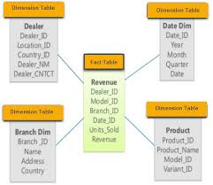
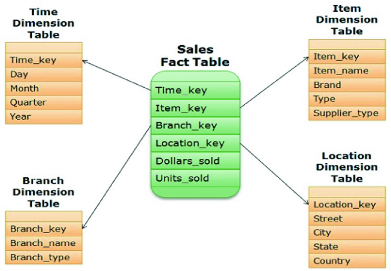

# Data Engineering Interview Preparation
## Table of Contents
## 1. [3 questions](#3_Questions) 

### 1. 3_Questions
[_Source link_](https://medium.com/better-programming/3-questions-you-should-be-able-to-answer-in-a-data-engineering-interview-8dc845785be6)
   **a. How would you approach developing a new analytical product as a data engineer?**
       * Understand the entire product/pipeline
       * Know why certain steps need to be taken and what to prioritize in the tool selection process
       * How is the data coming in? Is it consistent or irregular?
   **b. What is the difference between an  operational database and a data warehouse?**
       * Normalized databases are optimized for transactions that involve _Insert, Update, and Delete_ SQL statements.
       * These are standard operational databases, which need to focus on making transactions quickly without                     getting bogged down by calculations and data manipulations.
        * A data warehouse is built to support a data analytics product and analysis. This means performance is not               geared towards transactions--instead, it's aimed at aggregations, calculations, and select statements.
        * A data warehouse will have a slightly denormalized structure compared to an operational database.
        * In most data warehouses, a majority of tables will take on two different attributes:
                * historical transaction table -> fact table
                * categorical data table -> dimension tables
         * Fact table is essentially in the center. A standard data warehouse usually has a focus on the fact tables, and            all the dimension tables join to provide categorical information to the fact table.
         
   
   
   
   
   
   These are not the only tables that exist in a data warehouse. There are aggregate tables, snapshots, partitions,         and more. The goal is usually a report or dashboard that can automatically updated quickly.
   
   **c. Tell us about a time you had performance issues with an ETL and how did you fix it?**
   
   
   
   
         